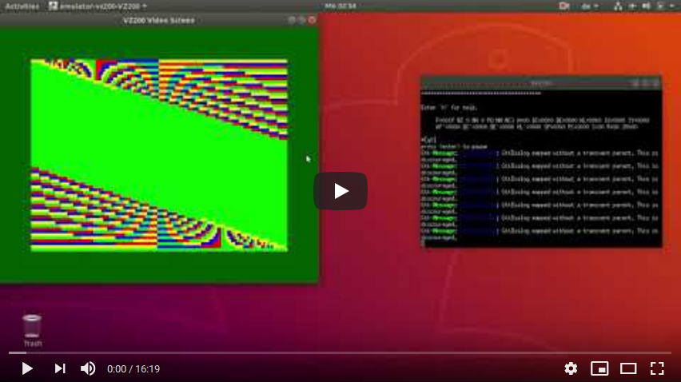
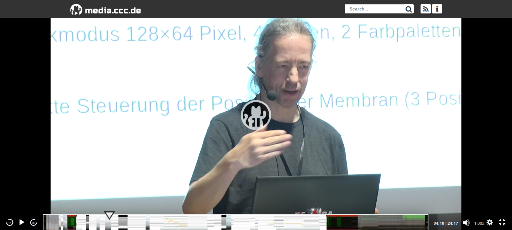
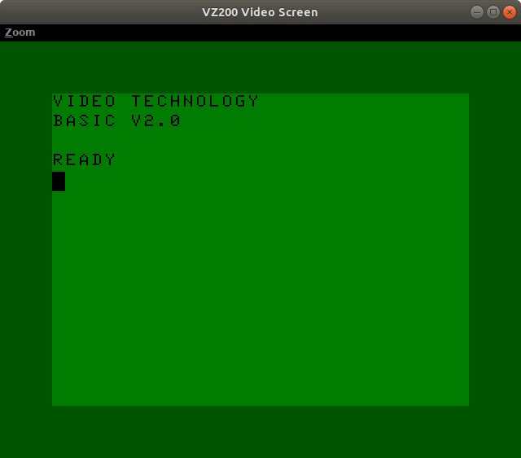
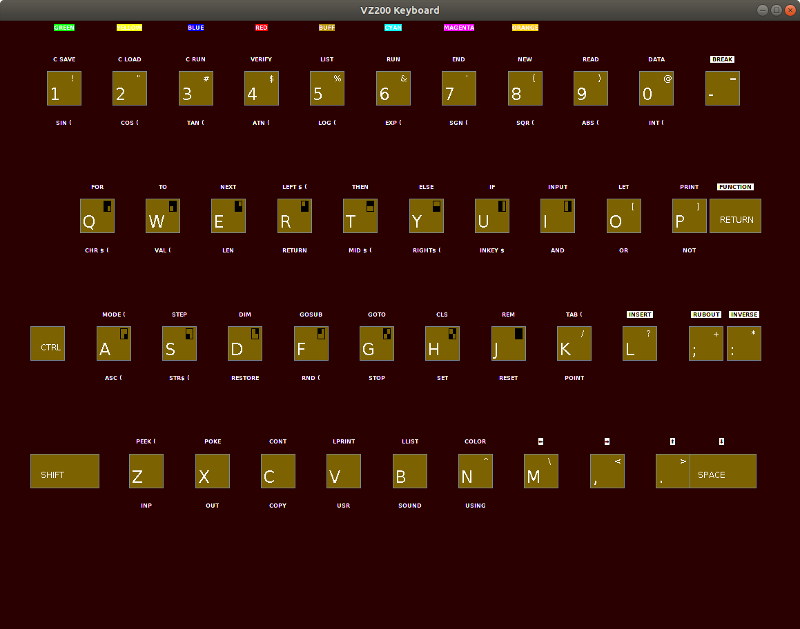
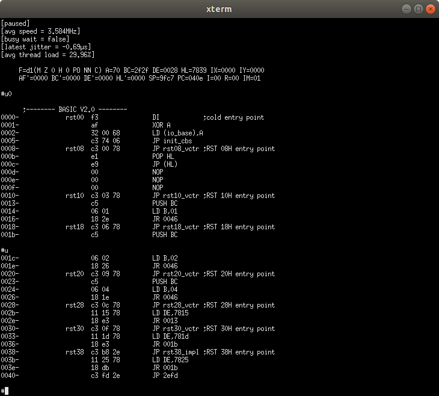
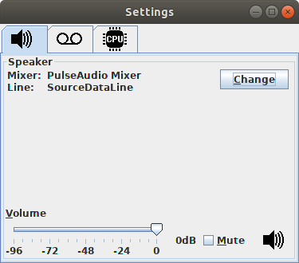
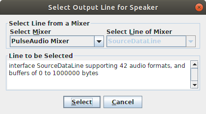
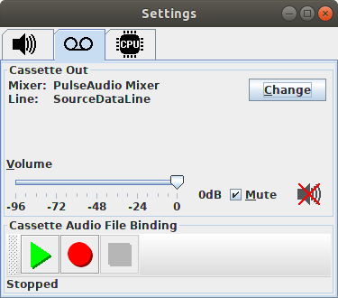
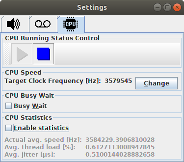
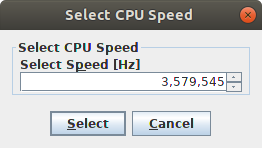

VZ200 / Z80 Emulator
====================

This project features a software emulation of the complete hardware of
a Z80 CPU and a VZ200 computer based on that CPU.

I will add more detailed documentation somewhat later, since
currently, many things are still changing and it would not make a
point to write documentation before the installation process has been
stabilized.  Also, I am still going to enhance usability (many options
are currently hard-wired constants in the code rather than being read
from some configuration file), which will also affect building and
running.  So please, be a little bit patient!  At least, I already
recorded some YouTube video that demonstrates that the core emulation
is already running:

<figure>
  <a href="https://youtu.be/S65sOWSTnGA">
    
  </a>
  <figcaption>Preliminary YouTobe Demo Video</caption>
</figure>

Talk @ GPN19
------------

For more documentation, see also my [talk at GPN 19][1] at
Gulaschprogrammiernacht '19 (GPN19) in Karlsruhe, Germany (in German
language) with a short introduction by Prof. Sebastian Ritterbusch, as
well as the corresponding set of slides as [OpenDocument presentation
(.odp) file][2] (in English language).

<figure>
  <a href="https://media.ccc.de/v/gpn19-114-retrocomputing-emulator-vz200-z80">
    
  </a>
  <figcaption>Talk @ GPN19, ZKM Karlsruhe</caption>
</figure>

Installing & Running
--------------------

In foresight of an upcoming, more detailed installation documentation:
Currently, for getting the code running, you have to download the
source code and compile it by yourself on a system that provides
standard Unix tools such as (GNU) make, (ba)sh, etc., and, of course,
a Java compiler. Executing "make all" should suffice to create a build
directory with (almost) everything needed to run the emulator.

Note that until I can solve all potential copyright issues regarding
the VZ200's ROM memory, I will exclude the 16kB of ROM from this
repository, which is needed to run the VZ200 emulation.  With one of
the next commits (still a TODO), you will be able to run the core Z80
emulator without that ROM with just getting a warning instead of an
error, that you are trying to run the emulator without any software.
If you do not have the ROM, you may trying googling for VZ200 and ROM,
and grab that ROM.  The ROM should be a file with exactly 16384 bytes.
Put this file as `./emulator/vz200/os.rom` below the build directory.
Then start Java with the main class as parameter, e.g. with

```
java -cp ../build emulator.vz200.VZ200
```

from within the source directory.

Features
--------

Here are some screenshots that illustrate the features and GUI of the
emulator.

### Application Frame Windows

The application frame windows include the VZ200's actual ouput screen
window, a virtual keyboard, and a monitor control and debug program.


#### The Screen Window

The screen window currently supports three different zoom factors (1,
2 and 3).  There are future plans for a full screen display mode that
will mimick a cathode ray tube's specific appearance.



Fig. 1: VZ200 Screen


#### The Keyboard

While most input can be easily done via the standard PC keyboard, the
VZ200's original keyboard contained special key combinations for
accessing block graphics characters, special editor control keys, but
also shortcuts for command keywords.  Mapping these special key
combinations to a standard PC keyboard may result in unexpected
behavior, especially on non-US keyboard layouts.  Therefore, key input
on the PC's keyboard is mapped to the VZ200's keyboard whenever
possible in a reasonable way.  Some special characters or functions,
however, may be accessible solely by clicking on the VZ200's virtual
keyboard.



Fig. 2: VZ200 Keyboard


#### The Monitor Console

The monitor control program is a special program that runs in a
console window and allows for inspection and manipulation of the CPU's
address space as well as all of the CPU's registers.  Features include
listing of memory contents as either Z80 unassembled menmonics or
hexadecimal bytes or ascii characters, as well as entering hexadecimal
data bytes.  Also, starting and stopping the CPU can be controlled via
the monitor, including useful tools for debugging like a trace and
single instruction step mode, or running until reaching a breakpoint.



Fig. 3: Monitor Console

The monitor's unassemble feature also allows for limited capabilities
of code comments and symbolic addresses and values.  For that purpose,
one can write a special XML annotation file that contains code
comments, code labels and symbolic values.  Whenever unassembling
machine instructions that match any of these meta information, that
information will be printed out along with the unassembled
instruction, thus resulting in an assembler listing that comes close
to a source code listing.  Here is an example snippet of such an
annotation file:

```
  <at address="0x7a9d">
    <label>fname_buf</label>
    <data-bytes length="0x11" />
    <header>
      ---- START file name buffer ----<br />
      file name buffer for currently processed cassette file,<br />
      max. 16 characters + trailing "\0"
    </header>
  </at>
  <at address="0x7ae6">
    <data-bytes length="0x1" />
  </at>
  <at address="0x7aad">
    <footer>---- END file name buffer ----</footer>
  </at>
  <at address="0x7aae">
    <label>next_crs_x</label>
    <data-bytes length="0x1" />
    <comment>
      x coordinate where to place cursor<br />
      after next text buffer to screen copy
    </comment>
  </at>
```

The idea of such an annotation file is that you can retrofit
annotations to assembler instructions of code separately from its
binary and source code representation, in particular if you do not own
or have access to the source code and thus can not put annotations
directly alongside the source code.  This is usually the case when you
reverse engineer binary code.  Of course, if you own the source code,
you do not need such retrofit annotations.


### Configuration Dialogs

The configuration dialogs currently support setting up the target of
the VZ200's speaker output and cassette ouput, the source of the
cassette input, and some properties of the CPU emulation.


#### Speaker Settings



Fig. 4: Speaker Settings

The VZ200's speaker can be mapped to any audio output line that is
available via Java's built-in AudioSystem class.  Note that the VZ200
produced sound by plucking a speaker's 3-state membrane controlled by
two flip-flops, while sound cards as of today expect a stream of
sample values.  The emulator automatically converts the emulated
plucked membrane's state into a continuous stream of samples
appropriate for a modern sound card.



Fig. 5: Speaker Line Selection


#### Cassette I/O Settings



Fig. 6: Cassette I/O Settings

Technically, the VZ200's cassette output works very much like the
speaker output: The binary data output is converted into a stream of
samples that the emulator can map on any audio output line that is
available via Java's built-in AudioSystem class.  Also, thanks to a
special function, the output can also directly be written onto disc as
an audio file.


#### CPU Settings



Fig. 7: CPU Settings

Beyond the basic control features in the monitor control program, the
CPU settings dialog enables the user to set up special CPU parameters,
including the emulated speed, and some CPU profiling / logging
features.  Also, one can decide between a busy waiting model that will
produce very exact timing on the micro scale but may challenge the
host's CPU power, and a more lazy, but much more host CPU saving mode.
Usually, even the more lazy mode will still produce a micro-scale
timing good enough for generating sound and graphics without flicker
(as compared to the busy waiting model).



Fig. 8: CPU Speed Selection


Audio Trouble Shooting
----------------------

At least on my Ubuntu 18.04 box, there is a problem with the new
`java-11-openjdk-amd64` version: It will find no audio devices.  The
emulation will still run, but sound (i.e. audio output and cassette
input / output) will not work.  If this problem also affects you, but
you want get running the VZ200's speaker and cassette input/output,
try installing and running the older `java-8-openjdk-amd64
version`instead; at least this works for me.  That is, on my Ubuntu
box, I am currently using

```
/usr/lib/jvm/java-8-openjdk-amd64/jre/bin/java -cp ../build emulator.vz200.VZ200
```

to start the emulator.

Limited Support for `.vz` Files
--------------------------------

There is limited, experimental support for reading `.vz` files.  `.vz`
files are the inofficial quasi standard for storing binary and basic
programs on standard discs.  You will find lots of software for the
VZ200 on the internet as `.vz` files.  However, the support for `.vz`
files is not yet thread safe.  That is why the implementation for that
support is not yet on the Git `main` branch, but on a branch called
`sloppy_vzfile_support`.  If you plan to use `.vz` files, you may want
to check out branch `sloppy_vzfile_support`.  However, since the
implementation is not yet thread safe, you should not try to load in a
`.vz` file while the CPU emulation is running (this is possible via
the graphical GUI).  In that case, the whole emulator might get stuck
in a dead lock due to some previous race condition.

I will first try to make the implementation on the Git `master` branch
thread safe; only then, I will re-integrate the
`sloppy_vzfile_support` branch into the `master` branch.

If you do not need support for `.vz` files, you probably want to stick
to the more stable `master` branch.

<!-- References -->

[1]: https://media.ccc.de/v/gpn19-114-retrocomputing-emulator-vz200-z80
[2]: ./doc/talk-gpn19/vz200_emulator_gpn19.odp
