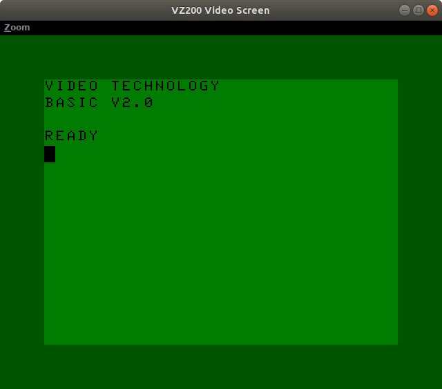
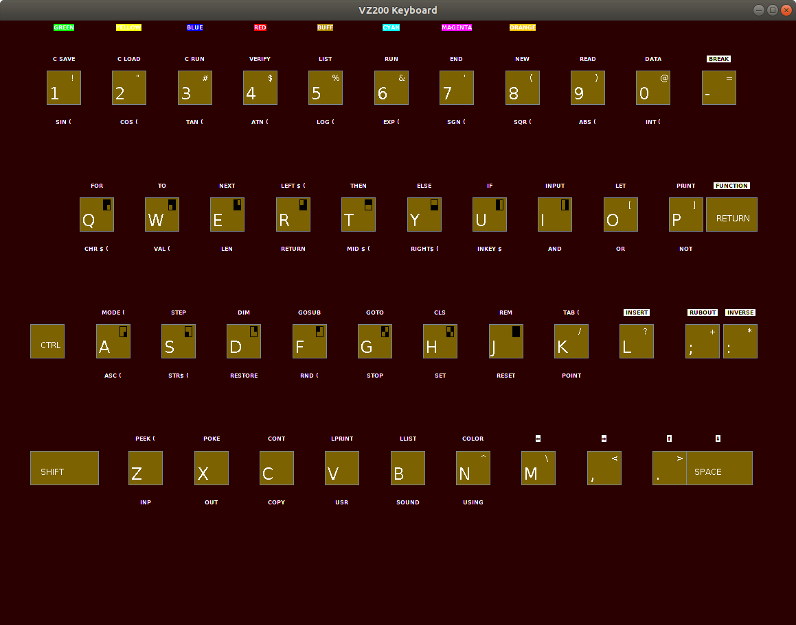
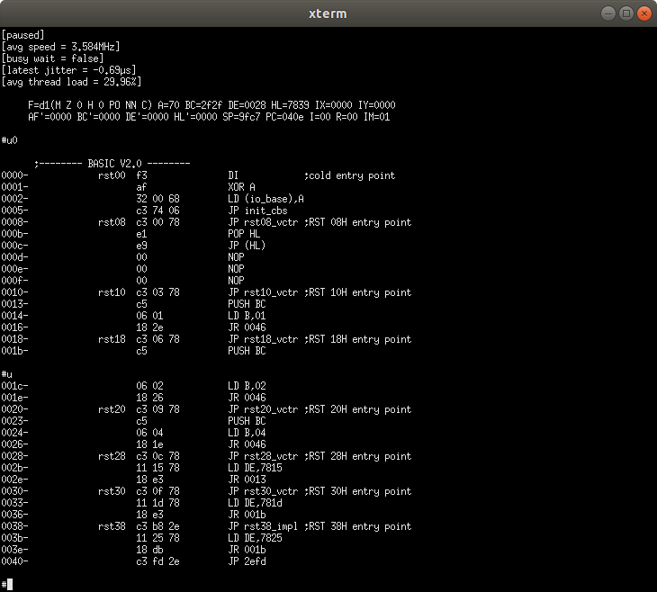
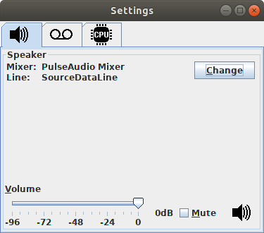
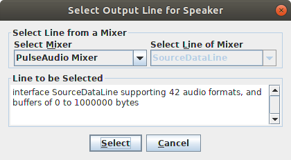
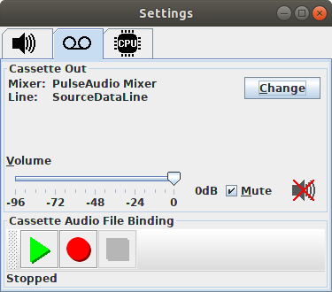
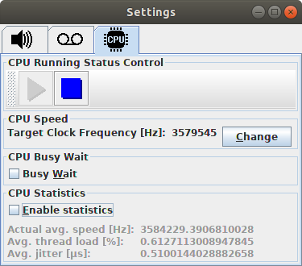
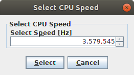

VZ200 / Z80 Emulator
====================

This project features a software emulation of the complete hardware of
a Z80 CPU and a VZ200 computer based on that CPU.

I will add more detailed documentation somewhat later, since
currently, many things are still changing and it would not make a
point to write documentation before the installation process has been
stabilized.  Also, I am still going to enhance usability (many options
are currently hard-wired constants in the code rather than being read
from some configuration file), which will also affect building and
running.  So please, be a little bit patient!  At least, I already
recorded some YouTube video that demonstrates that the core emulation
is already running:

[Preliminary YouTobe Demo Video](https://youtu.be/S65sOWSTnGA)

Installing & Running
--------------------

In foresight of an upcoming, more detailed installation documentation:
Currently, for getting the code running, you have to download the
source code and compile it by yourself on a system that provides
standard Unix tools such as (GNU) make, (ba)sh, etc., and, of course,
a Java compiler. Executing "make all" should suffice to create a build
directory with (almost) everything needed to run the emulator.

Note that until I can solve all potential copyright issues regarding
the VZ200's ROM memory, I will exclude the 16kB of ROM from this
repository, which is needed to run the VZ200 emulation.  With one of
the next commits (still a TODO), you will be able to run the core Z80
emulator without that ROM with just getting a warning instead of an
error, that you are trying to run the emulator without any software.
If you do not have the ROM, you may trying googling for VZ200 and ROM,
and grab that ROM.  The ROM should be a file with exactly 16384 bytes.
Put this file as `./emulator/vz200/os.rom` below the build directory.
Then start Java with the main class as parameter, e.g. with

```
java -cp ../build emulator.vz200.VZ200
```

from within the source directory.

Screenshots
-----------

Here are some screenshots that illustrate the emulator GUI.

### Application Frame Windows



Fig. 1: VZ200 Screen




Fig. 2: VZ200 Keyboard




Fig. 3: Monitor Console

### Configuration Dialogs



Fig. 4: Speaker Settings




Fig. 5: Speaker Line Selection




Fig. 6: Cassette I/O Settings




Fig. 7: CPU Settings




Fig. 8: CPU Speed Selection


Audio Trouble Shooting
----------------------

At least on my Ubuntu 18.04 box, there is a problem with the new
`java-11-openjdk-amd64` version: It will find no audio devices.  The
emulation will still run, but sound (i.e. audio output and cassette
input / output) will not work.  If this problem also affects you, but
you want get running the VZ200's speaker and cassette input/output,
try installing and running the older `java-8-openjdk-amd64
version`instead; at least this works for me.  That is, on my Ubuntu
box, I am currently using

```
/usr/lib/jvm/java-8-openjdk-amd64/jre/bin/java -cp ../build emulator.vz200.VZ200
```

to start the emulator.

Limited Support for `.vz` Files
--------------------------------

There is limited, experimental support for reading `.vz` files.  `.vz`
files are the inofficial quasi standard for storing binary and basic
programs on standard discs.  You will find lots of software for the
VZ200 on the internet as `.vz` files.  However, the support for `.vz`
files is not yet thread safe.  That is why the implementation for that
support is not yet on the Git `main` branch, but on a branch called
`sloppy_vzfile_support`.  If you plan to use `.vz` files, you may want
to check out branch `sloppy_vzfile_support`.  However, since the
implementation is not yet thread safe, you should not try to load in a
`.vz` file while the CPU emulation is running (this is possible via
the graphical GUI).  In that case, the whole emulator might get stuck
in a dead lock due to some previous race condition.

I will first try to make the implementation on the Git `master` branch
thread safe; only then, I will re-integrate the
`sloppy_vzfile_support` branch into the `master` branch.

If you do not need support for `.vz` files, you probably want to stick
to the more stable `master` branch.
